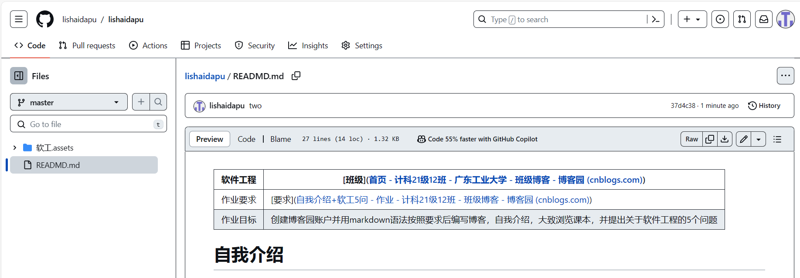

| 软件工程 | [班级]([首页 - 计科21级12班 - 广东工业大学 - 班级博客 - 博客园 (cnblogs.com)](https://edu.cnblogs.com/campus/gdgy/CSGrade21-12)) |
| -------- | ------------------------------------------------------------ |
| 作业要求 | [要求]([自我介绍+软工5问 - 作业 - 计科21级12班 - 班级博客 - 博客园 (cnblogs.com)](https://edu.cnblogs.com/campus/gdgy/CSGrade21-12/homework/13015)) |
| 作业目标 | 创建博客园账户并用markdown语法按照要求后编写博客，自我介绍，大致浏览课本，并提出关于软件工程的5个问题 |

# 自我介绍

我是计算机科学与技术1班的甘盛培，来自粤西地区，目前的学习方向是机器人路径规划。个人的兴趣爱好是关注游戏，主打就是有朋友一起才玩游戏，社交性拉满。没有人一起的时候基本就是看看新知识，刷刷视频。

来一张粤西的海镇楼

# 关于软件工程的问题

1. 软件工程的具体**概念**，现实生活中的**具体运用有什么**？
2. 关于软件项目的**各个阶段应该做什么**？
3. 在软件开发中如何**管理项目**和**规避风险**？
4. 软件设计的几种**方法**具体有什么**运用**？
5. 在**用户**层面的如何**设计软件**？

# 期望的收获

1. 能认识软件工程的魅力和实际的运用。
2. 希望能在团队项目中实际运用到这门课所学的知识。

# GitHub

建立同名id的仓库

